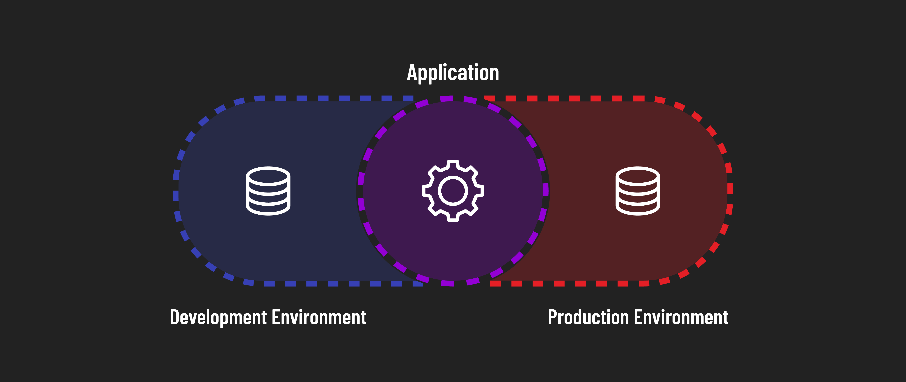

<h1>
  Environment Variables
  Concepts
</h1>

**Learning Objective:** By the end of this lesson, students will understand the role and importance of environments in full-stack development.

## Application environments

As a full-stack developer, your apps often interact with external databases, servers, and authentication services. Your apps also need to be aware of their local operating environment. This environment includes all the external systems and services your application communicates with and how they influence its functionality and behavior.

### Multiple environments

The environment an application runs in will likely vary depending on the context in which it operates. Suppose we have an application that requires a database to store information.

The best practice would be to have two *environments*:

- **Development environment**: While developing and testing, the app would connect to a test database filled with fake data for development purposes. This data can be modified or even deleted freely because it is not user-facing and, therefore, unimportant. This environment is commonly referred to as ***dev***.
- **Production environment**: When the app is deployed to the internet, where users can interact with it, the app will connect to a different production database. Here, maintaining data integrity is crucial as real user data is involved. This environment is commonly referred to as ***prod***.

You wouldn't want developers messing around with the data for actual users, as they might mess something up in the development process - impacting real users in detrimental ways.

The complexity, features of the app, and the size of the development team can significantly shape the number and types of environments used. Different projects may require different setups based on their specific needs and goals.

That said, development and production environments, as we’ve discussed, represent an appropriate starting point for any app.

> 📚 An application's *environment* is all the external factors that impact its operation in a given circumstance. It includes things like the configuration for an application (such as what database it should connect to).
